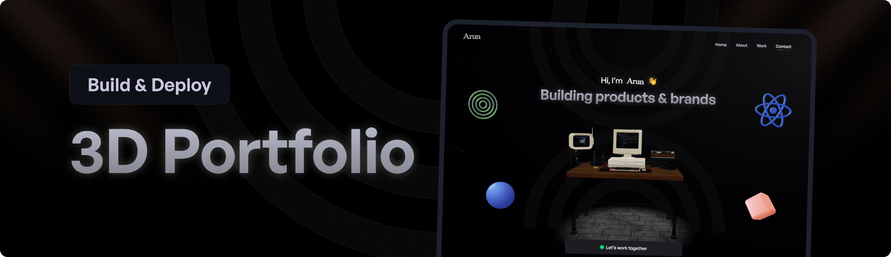

# ThreeJS Portfolio Website

<div align="center">
  <br />
      
    </a>
  <br />
  <div>
    
    
    
  </div>

</div>

---

---

## 🤖 Introduction

This is a personal portfolio website built with React, Three.js, Tailwind showcasing my projects, work experience, and skills. The website is organized into several sections, each providing a unique look at my background and the technologies I work with.

---

## ⚙️ Tech Stack

- **React.js**
- **Three.js**
- **React Three Fiber**
- **React Three Drei**
- **EmailJS**
- **Vite**
- **TailwindCSS**

---

## 🔋 Features

- **Immersive Hero Section**  
  An eye-catching 3D hacker-themed room that reacts to mouse movements, surrounded by animated mini-models.

- **Interactive About Me**  
  Features a sleek bento grid layout displaying personal information, a 3D globe pinpointing location, tech stack icons, and a one-click email copy option.

- **Dynamic Project Showcase**  
  Browse through live project demos displayed within a 3D computer model, seamlessly switching between different projects.

- **Engaging Experience Timeline**  
  Hover over career milestones to trigger interactive 3D animations, showcasing your professional journey.

- **Easy Contact Form**  
  A user-friendly email form for visitors to get in touch directly from the portfolio.

- **Clean Footer**  
  Minimalist design featuring links to social media for easy networking.

- **Fully Responsive**  
  Ensures a smooth browsing experience across all devices, from desktop to mobile.

And much more, including optimized code architecture and reusability.

---

## 🤸 Quick Start

Follow these steps to set up the project locally on your machine.

### Prerequisites

Ensure the following tools are installed on your system:

- [Git](https://git-scm.com/)
- [Node.js](https://nodejs.org/en)
- [npm](https://www.npmjs.com/) (Node Package Manager)

### Cloning the Repository

Run the following commands to clone and navigate to the project directory:

```bash
# git clone https://github.com/ArunRawat404/Portfolio-Website.git
cd Portfolio-Website
```

### Installation

Install project dependencies with npm:

```bash
npm install
```

### Set Up Environment Variables

1. Create a file named .env in the root of your project directory.
2. Add the following content:
   env
   Copy code

```env
VITE_SERVICE_ID = your_emailjs_service_id
VITE_TEMPLATE_ID = your_emailjs_template_id
VITE_PUBLIC_KEY = your_emailjs_public_key
```

3. Replace the placeholder values with your actual EmailJS credentials. You can obtain these credentials by signing up on the [EmailJS website](https://www.emailjs.com/).

### Running the Project

```bash
npm run dev
```

Open [http://localhost:5173](http://localhost:5173) in your browser to view the project.
